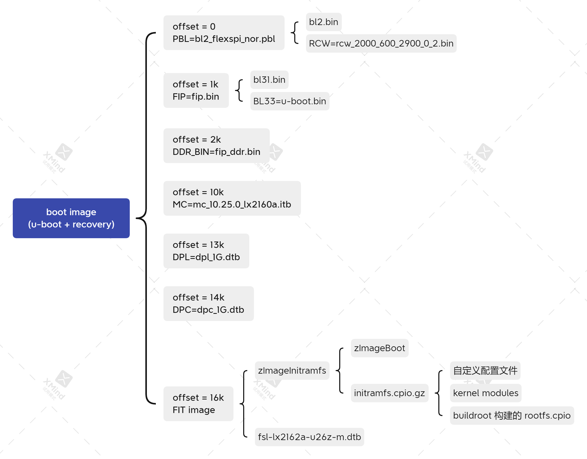

## 目标镜像文件结构



## 构建机环境准备

1. 安装依赖包 (Ubuntu 20.04)

```
sudo apt update
sudo apt install git quilt wget build-essential gcc-aarch64-linux-gnu rsync device-tree-compiler tcl unzip fakeroot u-boot-tools
```

2. 下载这个项目

```
git clone https://github.com/destin035/sn1000_soc_build.git
cd sn1000_soc_build
```

3. 获取源码压缩包

```
wget http://10.10.30.24:8088/s/XnHLYJ79MwSTp6j/download/sn1000_soc_downloads.tar.gz
tar xvf sn1000_soc_downloads.tar.gz
```

## u-boot

```
mkdir -p build/u-boot
tar xvf downloads/u-boot_lx2162a-bsp0.4.tgz -C build/u-boot
cp -r patches/u-boot/lx2162a-bsp0.4 build/u-boot/patches
cp build/u-boot/patches/series-lx2162au26z build/u-boot/patches/series
pushd build/u-boot && quilt push -a && popd
cp build/u-boot/patches/config-lx2162au26z build/u-boot/configs/lx2162a-lx2162au26z_custom_defconfig
ARCH=arm64 CROSS_COMPILE=aarch64-linux-gnu- BOARD=lx2162au26z make -C build/u-boot lx2162a-lx2162au26z_custom_defconfig
ARCH=arm64 CROSS_COMPILE=aarch64-linux-gnu- BOARD=lx2162au26z make -C build/u-boot -j 20
```

## mc

```
mkdir -p build/mc
tar xvf downloads/mc_lx2162a-bsp0.4.tgz -C build/mc
```

## mc-utils

```
mkdir -p build/mc-utils
tar xvf downloads/mc-utils_lx2162a-bsp0.4.tgz -C build/mc-utils
cp -r patches/mc-utils/lx2162a-bsp0.4 build/mc-utils/patches
cp build/mc-utils/patches/series-lx2162au26z build/mc-utils/patches/series
pushd build/mc-utils && quilt push -a && popd
SOURCEDIR=. make -C build/mc-utils/config
```

## rcw

```
mkdir -p build/rcw
tar xvf downloads/rcw_lx2162a-bsp0.4.tgz -C build/rcw
cp -r patches/rcw/lx2162a-bsp0.4 build/rcw/patches
cp build/rcw/patches/series-lx2162a build/rcw/patches/series
pushd build/rcw && quilt push -a && popd
make -C build/rcw -j 20
```

## ddr

```
mkdir -p build/ddr-phy-binary
tar xvf downloads/ddr_lx2162a-bsp0.4.tgz -C build/ddr-phy-binary
```

## atf

https://trustedfirmware-a.readthedocs.io/en/latest/getting_started/build-options.html

```
mkdir -p build/atf
tar xvf downloads/atf_lx2162a-bsp0.4.tgz -C build/atf
cp -r patches/atf/lx2162a-bsp0.4 build/atf/patches
cp build/atf/patches/series-lx2162a build/atf/patches/series
pushd build/atf && quilt push -a && popd
CROSS_COMPILE=aarch64-linux-gnu- make -C build/atf realclean
CROSS_COMPILE=aarch64-linux-gnu- make -C build/atf PLAT=lx2162au26z all \
	fip BOOT_MODE=flexspi_nor BL33=$PWD/build/u-boot/u-boot.bin \
	pbl RCW=$PWD/build/rcw/lx2162au26z/NNNN_NNNN_PPPP_PPPP_RR_0_2/rcw_2000_600_2900_0_2.bin
```

## 制作启动镜像 (u-boot)

```
mkdir -p build/images
IMAGE=build/images/boot_xspi.img
rm -f $IMAGE

dd if=build/atf/build/lx2162au26z/release/bl2_flexspi_nor.pbl of=$IMAGE bs=1024 seek=0
dd if=build/atf/build/lx2162au26z/release/fip.bin             of=$IMAGE bs=1024 seek=1024
dd if=build/ddr-phy-binary/lx2160a/fip_ddr.bin                of=$IMAGE bs=1024 seek=2048
```

或者

```
mkdir -p build/images
IMAGE=build/images/boot_xspi.img
rm -f $IMAGE

make -f image.mk \
	BOOT=XSPI \
	IMAGE=$IMAGE \
	PBL=build/atf/build/lx2162au26z/release/bl2_flexspi_nor.pbl \
	FIP=build/atf/build/lx2162au26z/release/fip.bin \
	DDR_BIN=build/ddr-phy-binary/lx2160a/fip_ddr.bin
```

使用 xnsocadmin 工具将 `build/images/boot_xspi.img` 写入 arm soc 的 flash

## kernel

```
mkdir -p build/kernel
tar xvf downloads/kernel_lx2162a-bsp0.4.tgz -C build/kernel
cp -r patches/kernel/lx2162a-bsp0.4 build/kernel/patches
cp build/kernel/patches/series-lx2162a build/kernel/patches/series
pushd build/kernel && quilt push -a && popd
cp build/kernel/patches/config-lx2162au26z build/kernel/arch/arm64/configs/lx2162au26z_defconfig
ARCH=arm64 CROSS_COMPILE=aarch64-linux-gnu- BOARD=lx2162au26z LOCALVERSION=-destin make -C build/kernel lx2162au26z_defconfig
ARCH=arm64 CROSS_COMPILE=aarch64-linux-gnu- BOARD=lx2162au26z LOCALVERSION=-destin make -C build/kernel -j 20
```

拷贝编译出的内核镜像文件 `build/kernel/arch/arm64/boot/Image.gz`，作为 emmc 启动的内核

```
cp build/kernel/arch/arm64/boot/Image.gz build/images/zImageBoot
```

## kernel modules

```
mkdir -p build/linux-modules
ARCH=arm64 CROSS_COMPILE=aarch64-linux-gnu- BOARD=lx2162au26z LOCALVERSION=-destin make -C build/kernel -j 20 modules
ARCH=arm64 CROSS_COMPILE=aarch64-linux-gnu- BOARD=lx2162au26z LOCALVERSION=-destin make -C build/kernel \
	INSTALL_MOD_PATH=$PWD/build/linux-modules modules_install
```

## sfc driver module

```
mkdir -p build/net-driver
dpkg -x downloads/sfc-dkms_5.3.8.1011_all.deb build/net-driver
ARCH=arm64 CROSS_COMPILE=aarch64-linux-gnu- BOARD=lx2162au26z LOCALVERSION=-destin make \
	-C build/net-driver/usr/src/sfc-5.3.8.1011 \
	KPATH=$PWD/build/kernel -j 20
ARCH=arm64 CROSS_COMPILE=aarch64-linux-gnu- BOARD=lx2162au26z LOCALVERSION=-destin make \
	-C build/net-driver/usr/src/sfc-5.3.8.1011 \
	KPATH=$PWD/build/kernel \
	INSTALL_MOD_PATH=$PWD/build/linux-modules \
	INSTALL_MOD_DIR=kernel/drivers/net/ethernet/sfc modules_install
```

## buildroot 构建 rootfs

```
mkdir -p build/buildroot
tar xvf downloads/buildroot_2020.02.3.tgz -C build/buildroot
tar xvf downloads/buildroot-dl.tgz -C build/buildroot
cp -r patches/buildroot/2020.02.3 build/buildroot/patches
FORCE_UNSAFE_CONFIGURE=1 make -C build/buildroot defconfig BR2_DEFCONFIG=patches/config-lx2162a
FORCE_UNSAFE_CONFIGURE=1 make -C build/buildroot -j 20
```

构建时间比较久，完成后输出镜像文件 `build/buildroot/output/images/rootfs.cpio`

## 制作 initramfs

打包脚本

```
cat > build/make_initramfs << EOF
cpio -i -d -H newc -F $PWD/build/buildroot/output/images/rootfs.cpio --no-absolute-filenames
echo "sfc" >> /etc/modules
mkdir -p lib/modules/5.4.3-destin
cp $PWD/build/linux-modules/lib/modules/5.4.3-destin/modules.* lib/modules/5.4.3-destin
mkdir -p lib/modules/5.4.3-destin/kernel/drivers/net/ethernet/sfc
cp $PWD/build/linux-modules/lib/modules/5.4.3-destin/kernel/drivers/net/ethernet/sfc/*.ko lib/modules/5.4.3-destin/kernel/drivers/net/ethernet/sfc
/sbin/depmod -ae -b . -F $PWD/build/kernel/System.map 5.4.3-destin
chown -R root:root lib
find . | cpio -o -H newc | gzip > $PWD/build/images/initramfs.cpio.gz
EOF
```

在 fakeroot 环境执行打包脚本

```
rm -rf build/initramfs
mkdir -p build/initramfs
chmod +x build/make_initramfs
pushd build/initramfs && fakeroot ../make_initramfs && popd
```

## 合并 initramfs 到内核镜像

```
ARCH=arm64 CROSS_COMPILE=aarch64-linux-gnu- BOARD=lx2162au26z LOCALVERSION=-destin \
	make -C build/kernel \
	CONFIG_INITRAMFS_SOURCE=$PWD/build/images/initramfs.cpio.gz \
	CONFIG_INITRAMFS_COMPRESSION_GZIP=y Image Image.gz
```

拷贝编译出的内核镜像文件 `build/kernel/arch/arm64/boot/Image.gz`，作为 recovery 启动的内核

```
cp build/kernel/arch/arm64/boot/Image.gz build/images/zImageInitramfs
```

## 制作 FIT 镜像 (recovery)

描述配置

https://doc.coreboot.org/lib/payloads/fit.html

```
cat > build/kernel-initramfs.its << EOF
/dts-v1/;
/ {
    description = "arm64 kernel, ramdisk and FDT blob";
    images {
        kernel {
                description = "ARM64 Kernel";
                data = /incbin/("$PWD/build/images/zImageInitramfs");
                type = "kernel";
                arch = "arm64";
                os = "linux";
                compression = "gzip";
                load = <0x80080000>;
                entry = <0x80080000>;
                hash@1 {
                    algo = "crc32";
                };
        };
        lx2162au26z-dtb {
            description = "lx2162au26z-dtb";
            data = /incbin/("$PWD/build/kernel/arch/arm64/boot/dts/freescale/fsl-lx2162a-u26z-m.dtb");
            type = "flat_dt";
            arch = "arm64";
            os = "linux";
            compression = "none";
            load = <0x90000000>;
            hash@1 {
                algo = "crc32";
            };
        };
    };
    configurations {
        default = "lx2162au26z";
        lx2162au26z {
            description = "config for lx2162au26z";
            kernel = "kernel";
            fdt = "lx2162au26z-dtb";
        };
    };
};
EOF
```

生成 initramfs + kernel + dtb 的 FIT 镜像

```
mkimage -f build/kernel-initramfs.its build/images/kernel-initramfs.itb
```

## 制作启动镜像 (u-boot + recovery)

```
mkdir -p build/images
IMAGE=build/images/boot_xspi_recovery.img
rm -f $IMAGE

dd if=build/atf/build/lx2162au26z/release/bl2_flexspi_nor.pbl of=$IMAGE bs=1024 seek=0
dd if=build/atf/build/lx2162au26z/release/fip.bin             of=$IMAGE bs=1024 seek=1024
dd if=build/ddr-phy-binary/lx2160a/fip_ddr.bin                of=$IMAGE bs=1024 seek=2048
dd if=build/mc/lx216xa/mc_10.25.0_lx2160a.itb                 of=$IMAGE bs=1024 seek=10240
dd if=build/mc-utils/config/lx2162a/U26Z/dpl_1G.dtb           of=$IMAGE bs=1024 seek=13312
dd if=build/mc-utils/config/lx2162a/U26Z/dpc_1G.dtb           of=$IMAGE bs=1024 seek=14336
dd if=build/images/kernel-initramfs.itb                       of=$IMAGE bs=1024 seek=16384
```

或者

```
mkdir -p build/images
IMAGE=build/images/boot_xspi_recovery.img
rm -f $IMAGE

make -f image.mk \
	BOOT=XSPI \
	IMAGE=$IMAGE \
	PBL=build/atf/build/lx2162au26z/release/bl2_flexspi_nor.pbl \
	FIP=build/atf/build/lx2162au26z/release/fip.bin \
	DDR_BIN=build/ddr-phy-binary/lx2160a/fip_ddr.bin \
	MC_BIN=build/mc/lx216xa/mc_10.25.0_lx2160a.itb \
	DPL_BIN=build/mc-utils/config/lx2162a/U26Z/dpl_1G.dtb \
	DPC_BIN=build/mc-utils/config/lx2162a/U26Z/dpc_1G.dtb \
	KERNEL_ITB=build/images/kernel-initramfs.itb
```

## 制作 emmc 镜像 (ubuntu 20.04)

## 术语

| 缩写 | 描述 |
|------|------|
| PBL | Pre-Boot Loader |
| RCW | Reset Configuration Word |
| FIP | Firmware Image Package |
| DPAA | Data Path Acceleration Architecture |
| DPC | Data Path Control |
| DPL | Data Path Layout |
| FIT | Flattened uImage Tree |
